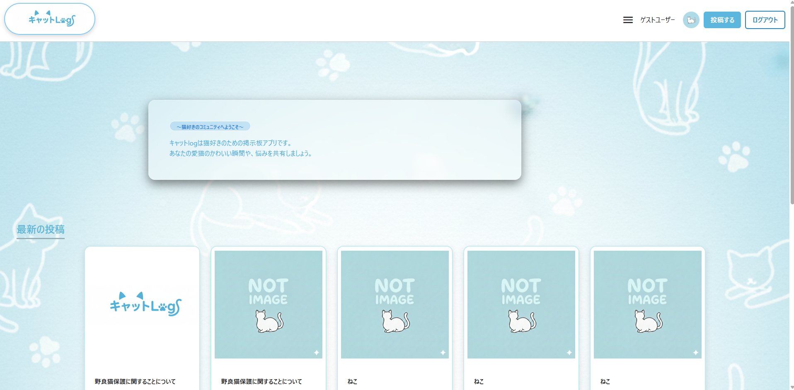
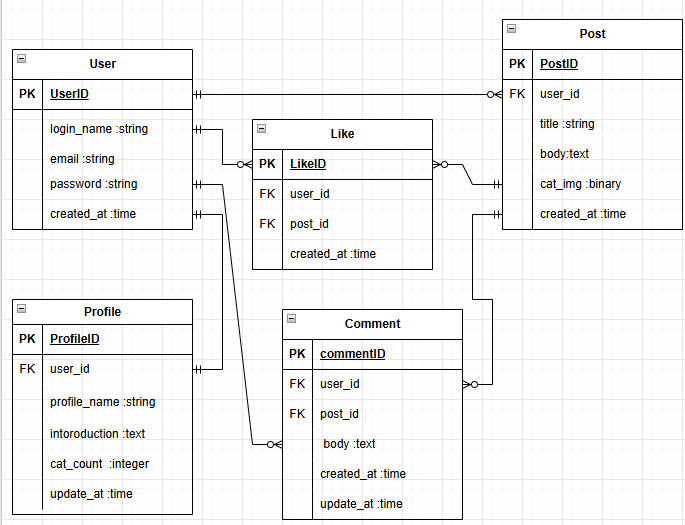

#　🐾キャットLog

「うちの子の可愛さを自慢したい！」
「これから猫を飼いたいけれど、何に気をつければいい？」
そんな飼い主さんと、未来の飼い主さんを繋ぐ、猫特化型のコミュニティアプリです。

---

## 😸 アプリの概要
愛猫の可愛い瞬間を写真でシェアしたり、猫との暮らしで感じる「癒し」や「悩み」を共有したりできる掲示板です。

### 🌟 アプリの使用方法
* **可愛い瞬間を投稿**：愛猫のベストショットを投稿して、みんなに癒やしを届けられます。
* **知恵の共有**：おすすめのキャットフードや、お気に入りの便利グッズなど、猫との暮らしに役立つ情報を交換できます。
* **未来の飼い主さんをサポート**：これから猫を迎えようとしている人が、実際の飼い主さんのリアルな投稿を見て参考にできます。
* **悩みの相談**：猫との生活で困ったことを気軽に相談し、共感し合える仲間が見つかります。

---

## 💡 開発の動機・背景
私自身も猫を飼っており、日々愛猫の可愛い仕草に癒やされています。スマートフォンの写真フォルダには愛猫の写真が溢れていますが、それを「猫好きだけが集まる場所」で、気兼ねなく共有したいと思ったのが開発のきっかけです。

---

### 😼 工夫した点・技術的なこだわり

* **「癒やされた！」ボタン（いいね機能）の非同期化**
  猫の可愛い写真を見て「癒やされた！」と思った瞬間に、画面をリロードすることなくリアクションを届けられるよう、**Hotwire (Turbo/Stimulus)** を活用して実装しました。

* **猫の世界観を大切にしたUIデザイン**
  アプリを開いた瞬間にコンセプトが伝わるよう、タイトルロゴには猫のモチーフを取り入れ、親しみやすいデザインにこだわりました。

* **ゲストログイン機能**
  「まずはアプリの雰囲気を知りたい」という方が、会員登録の手間なくすぐに掲示板を体験できるよう、ワンクリックでログインできる機能を搭載しました。

---

###　📊ER図

